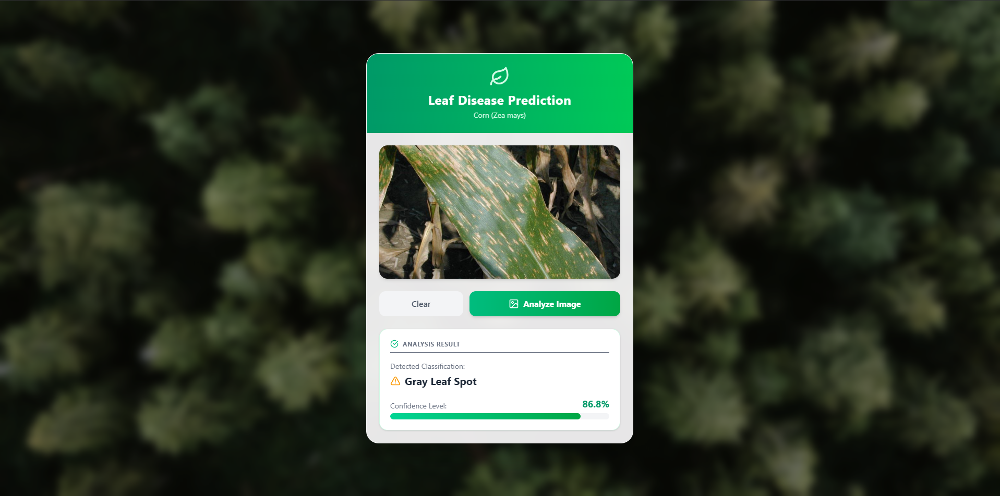

# Classificador de Doenças Foliares no Milho utilizando Deep Learning


<p align="center">
  <em>Uma análise comparativa de CNNs para o diagnóstico de precisão na agricultura, com uma prova de conceito em aplicação web.</em>
</p>
<p align="center">
  Trabalho de Conclusão de Curso de <strong>Gustavo Kermaunar Volobueff</strong>
</p>

---

### 📋 Índice

- [📖 Sobre o Projeto](#-sobre-o-projeto)
- [📸 Demonstração da Aplicação](#-demonstração-da-aplicação)
- [🛠️ Tecnologias Utilizadas](#️-tecnologias-utilizadas)
- [🏆 Resultados do Modelo](#-resultados-do-modelo)
- [📂 Estrutura do Repositório](#-estrutura-do-repositório)
- [🚀 Como Executar o Projeto](#-como-executar-o-projeto)
- [📜 Licença](#-licença)
- [👨‍💻 Autor](#-autor)

---

## 📖 Sobre o Projeto

As doenças foliares em culturas agrícolas de grande importância, como o milho, representam um desafio crítico que impacta negativamente a produtividade, a economia do agronegócio e a segurança alimentar. O diagnóstico tradicional, baseado na inspeção visual, é frequentemente subjetivo e ineficaz em larga escala, criando a necessidade de ferramentas automáticas e precisas. Para endereçar esta lacuna, este trabalho propõe o desenvolvimento e a validação de um sistema de classificação de alta performance para patologias em folhas de milho, utilizando técnicas de aprendizado profundo e visão computacional.

Para tal, foram comparadas três arquiteturas de Redes Neurais Convolucionais (ResNet101, MobileNetV3-Large e EfficientNetV2M), treinadas em dois conjuntos de dados públicos (PlantVillage + PlantDoc e CD\&S) através de uma robusta pipeline de pré-processamento, com balanceamento de classes e aplicação de técnicas de regularização.

---

## 📸 Demonstração da Aplicação

A viabilidade da solução foi demonstrada através de uma aplicação web interativa, que permite ao usuário submeter uma imagem de uma folha de milho e receber a classificação em tempo real.

| Tela Inicial | Resultado da Classificação |
| :---: | :---: |
|  |  |
| *O usuário pode arrastar ou clicar para selecionar uma imagem.* | *O modelo classifica a doença e exibe a confiança da predição.* |

---

## 🛠️ Tecnologias Utilizadas

O projeto foi dividido em três componentes principais, cada um com seu próprio conjunto de tecnologias:

- **🤖 Inteligência Artificial / Machine Learning:**
  - **Python:** Linguagem principal para o treinamento e a API.
  - **TensorFlow/Keras:** Framework para construção e treinamento dos modelos de CNN.
  - **Scikit-learn:** Utilizado para gerar as métricas de avaliação (Matriz de Confusão, Relatório de Classificação).
  - **NumPy & Matplotlib:** Para manipulação de dados numéricos e visualização.

- **⚙️ Backend (API):**
  - **FastAPI:** Framework Python de alta performance para a construção da API que serve o modelo.

- **🖥️ Frontend:**
  - **React (com Vite):** Biblioteca JavaScript para a construção da interface do usuário.
  - **TailwindCSS:** Framework CSS para estilização rápida e responsiva.
  - **Axios:** Cliente HTTP para a comunicação entre o frontend e a API.

---

## 🏆 Resultados do Modelo

A análise comparativa entre as três arquiteturas revelou a superioridade do modelo **EfficientNetV2M**, especialmente quando treinado com imagens de maior resolução.

| Modelo | Dataset de Melhor Desempenho | Resolução | Acurácia de Validação |
| :--- | :--- | :---: | :---: |
| 🥇 **EfficientNetV2M** | **CD&S** | **480x480** | **99.72%** |
| 🥈 **EfficientNetV2M** | PlantDoc + PlantVillage | 480x480 | 98.79% |

Este desempenho supera benchmarks recentes na literatura, validando a eficácia da pipeline de treinamento e regularização proposta.

---

## 🚀 Como Executar o Projeto

Siga os passos abaixo para executar a aplicação completa em seu ambiente local.

### **Importante: Arquivos dos Modelos**

> **Observação:** Os arquivos dos modelos treinados (`.keras`) não estão incluídos neste repositório devido ao seu tamanho excessivo (superior a 300 MB), que ultrapassa os limites do GitHub LFS. Para executar a API, você precisará fazer o download do arquivo do modelo (`efficientnetv2m_..._classifier.keras`) separadamente a partir de um drive pessoal e colocá-lo em uma pasta chamada `saved_models` na raiz do projeto. O código em `api/main.py` espera encontrar o modelo neste local.

### Pré-requisitos

- **Git:** Para clonar o repositório.
- **Python:** Versão `3.12.6` ou superior.
- **Node.js:** Versão `v20.18.1` ou superior (inclui `npm` `10.8.2` ou superior).

### 1. Clonar o Repositório

```bash
git clone [https://github.com/gustavokv/disease-detection.git](https://github.com/gustavokv/disease-detection.git)
cd disease-detection
```

### 2. Executar o Backend (API)
Abra um terminal na pasta raiz do projeto.

```bash
# Navegue até a pasta da API
cd api

# Crie e ative um ambiente virtual (recomendado)
python -m venv venv
source venv/bin/activate  # No Linux/macOS
# ou
.\venv\Scripts\activate  # No Windows

# Instale as dependências do backend
pip install -r requirements.txt

# Inicie o servidor da API
python main.py
```
O servidor FastAPI estará rodando em http://127.0.0.1:8000.

### 3. Executar o Frontend
Abra um novo terminal na pasta raiz do projeto.

```bash

# Navegue até a pasta do frontend
cd frontend

# Instale as dependências do frontend
npm install

# Inicie a aplicação de desenvolvimento
npm run dev

```

A aplicação React estará acessível em seu navegador no endereço http://localhost:5173.

## 📜 Licença

Este projeto está sob a licença MIT. Veja o arquivo [LICENSE](LICENSE) para mais detalhes.

## 👨‍💻 Autor
<b>Gustavo Kermaunar Volobueff</b>

[GitHub](https://github.com/gustavokv)

[LinkedIn](https://www.linkedin.com/in/gustavo-kermaunar-volobueff)
